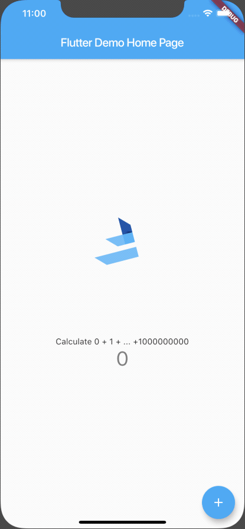
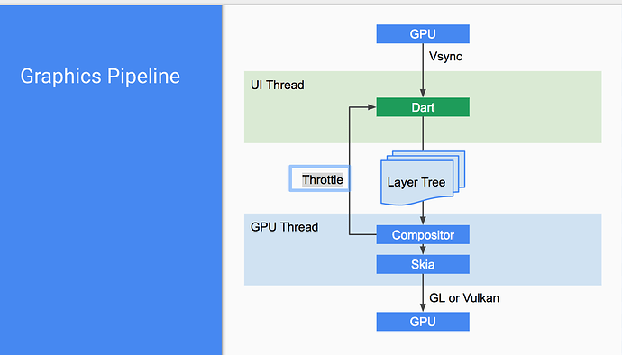
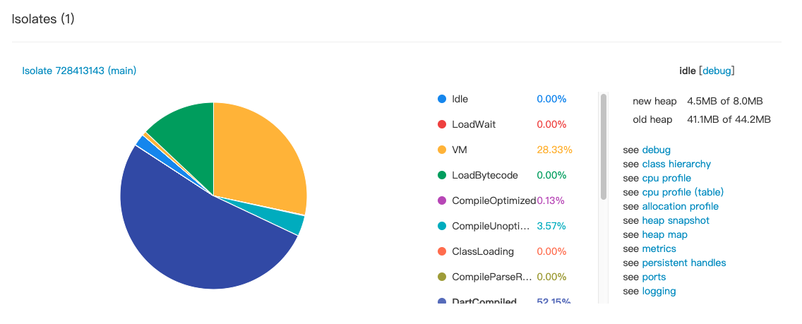
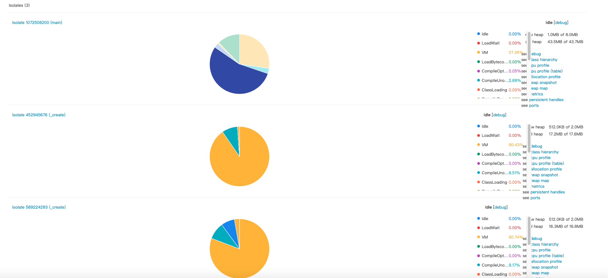

# Flutter | 性能优化——如何避免应用 jank

## 前言
流畅的用户体验一直是每一位开发者的不断追求，为了让自己的应用是否能给用户带来持续的高帧率渲染体验，我们自然想要极力避免发生 jank（卡顿，不流畅）。

本文将会解释为什么即使在 Flutter 高性能的渲染能力下，应用还是可能会出现 jank，以及我们应该如何处理这些情况。这是 Flutter 性能分析系列的第一篇文章，后续将会持续剖析 Flutter 中渲染流程以及性能优化。

## 什么时候会产生 jank？
我见过许多开发者在刚上手了 Flutter 之后，尝试开发了一些应用，然而并没有取得比较好的性能表现。例如在长列表加载的时候可能会出现明显卡顿的情况（当然这并不常见）。当你对这种情况没有头绪的时候，可能会误以为是 Flutter 的渲染还不够高效，然而大概率是你的 **姿势不对**。我们来看一个小例子。



在屏幕中心有一个一直旋转的 FlutterLogo，当我们点击按钮后，开始计算 0 + 1 + ... +1000000000。这里可以很明显的感受到明显的卡顿。为什么会出现这种情况呢？

### Flutter Rendering Pipeline



Flutter 由 GPU 的 vsync 信号驱动，每一次信号都会走一个完整的 pipeline（我们现在并不需要关心整个流程的具体细节），而通常我们开发者会接触到的部分就是使用 dart 代码，经过 build -> layout -> paint 最后生成一个 layer，整个过程都在一个 UI 线程中完成。Flutter 需要在每秒60次，也就是 16.67 ms 通过 vsync 进行一次 pipline。

在 Android 中我们是不能在 主线程（UI线程）中进行耗时操作的，如果做一些比较繁重的操作，比如网络请求、数据库操作等相关操作，就会导致 UI 线程卡住，触发 ANR。所以我们需要把这些操作放在子线程去做，通过 handler/looper/message queue 三板斧把结果传给主线程。而 dart 天生是单线程模式，为什么我们能够轻松的做这些任务，而不需要另开一个线程呢？

熟悉 dart 的同学肯定了解 event loop 机制了，通过异步处理我们可以把一个方法在执行过程中暂停，首先保证我们的同步方法能够按时执行（这也是为什么 setState 中只能进行同步操作的缘故）。而整个 pipline 是一次同步的任务，所以异步任务就会暂停，等待 pipline 执行结束，这样就不会因为进行耗时操作卡住 UI。


但是单线程毕竟也有它的局限，但是当我们有一些比较重的同步处理任务，例如解析大量 json（这是一个同步操作），或是处理图片这样的操作，很可能处理时间会超过一个 vsync 时间，这样 Flutter 就不能及时将 layer 送到 GPU 线程，导致应用 jank。


在上面这个例子中，我们通过计算 0 + 1 + ... +1000000000 来模拟一个耗时的 json 解析操作，由于它是一个同步的行为，所以它的计算不会被暂停。我们这个复杂的计算任务耗时超过了一次 sync 时间，所以产生了明显的 jank。

``` dart
int doSomeHeavyWork() {
    int res = 0;
    for (int i = 0; i <= 1000000000; i++) {
      res += i;
    }
    return res;
  }
```

## 如何解决
既然 dart 单线程无法解决这样的问题，我们很容易就会想到使用多线程解决这个问题。在 dart 中，它的线程概念被称为 isolate。

它与我们之前理解的 Thread 概念有所不同，各个 isolate 之间是无法共享内存空间，isolate 之间有自己的 event loop。我们只能通过 Port 传递消息，然后在另一个 isolate 中处理然后将结果传递回来，这样我们的 UI 线程就有更多余力处理 pipeline，而不会被卡住。更多概念性的描述请参考 isolate [API文档](https://api.dartlang.org/stable/2.5.2/dart-isolate/Isolate-class.html)。

### 创建一个 isolate
我们可以通过 `Isolate.spawn` 创建一个 isolate。

``` dart
static Future<Isolate> spawn<T>(void entryPoint(T message),T message);
```
当我们调用 `Isolate.spawn` 的时候，它将会返回一个对 isolate 的引用的 Future。我们可以通过这个 isolate 来控制创建出的 Isolate，例如 pause、resume、kill 等等。

- entryPoint：这里传入我们想要在其他 isolate 中执行的方法，入参是一个任意类型的 message。entryPoint 只能是顶层方法或静态方法，且返回值为 void。
- message：创建 Isolate 第一个调用方法的入参，可以是任意值。

但是在此之前我们必须要创建两个 isolate 之间沟通的桥梁。

#### ReceivePort / SendPort
在两个 isolate 之间，我们必须通过 port 来传递 message。ReceivePort 与 SendPort 就像是一部单向通信电话。ReceivePort 自带一部 SendPort，当我们创建 isolate 的时候，就把 ReceivePort 的 SendPort 丢给创建出来的 isolate。当新的 isolate 完成了计算任务时，通过这个 sendPort 去 send message。

``` dart
static void _methodRunAnotherIsolate(dynamic message) {
    if (message is SendPort) {
      message.send('Isolate Created!');
    }
  }
```
这里假设先有一个需要在其他 isolate 中执行的方法，入参是一个 SendPort。需要注意的是,这里的方法**只能是顶层方法或静态方法**，所以我们这里使用了 static 修饰，并让其变成一个私有方法("_")。它的返回值也只能是 void，你可能会问，那我们如何获得结果呢？

还记得我们刚才创建的 ReceivePort 吗。是的，现在我们就需要监听这个 ReceivePort 来获得 sendPort 传递的 message。

``` dart
createIsolate() async {
    ReceivePort receivePort = ReceivePort();
    try {
    // create isolate
      isolate =
          await Isolate.spawn(_methodRunAnotherIsolate, receivePort.sendPort);
          
    // listen message from another isolate      
      receivePort.listen((dynamic message) {
          print(message.toString());
      });
    } catch (e) {
      print(e.toString());
    } finally {
      isolate.addOnExitListener(receivePort.sendPort,
          response: "isolate has been killed");
    }
    isolate?.kill();
  }
```

我们先创建出 ReceivePort，然后在 `Isolate.spawn` 的时候将 `receivePort.sendPort` 作为 message 传入新的 isolate。

然后监听 receivePort，并打印收听到的 message。这里需要注意的是，我们需要手动调用 `isolate?.kill()` 来关闭这个 isolate。

输出结果：
> flutter: Isolate Created!

> flutter: isolate has been killed

实际上这里不写 isolate?.kill() 也会在 gc 时自动销毁 isolate。

这时候你可能会问，我们的 `entryPoint` 只允许有一个入参，如果我们想要执行的方法需要传入其他参数怎么办呢。

#### 定义协议
其实很简单，我们定义一个协议就行了。比如像下面这样我们定义一个 `SpawnMessageProtocol` 作为 message。

``` dart
class SpawnMessageProtocol{
  final SendPort sendPort;
  final String url;
  SpawnMessageProtocol(this.sendPort, this.url);
}
```

协议中包含 SendPort 即可。

### 更方便的 Compute
刚才我们使用的 `Isolate.spawn` 创建 Isolate 自然会觉得太过复杂，有没有一种更好的方式呢。实际上 Flutter 已经为我们封装了一些实用方法，让我们能够更加自然地使用多线程进行处理。这里我们先创建一个需要在其他 isolate 中运行的方法。
``` dart
  static int _doSomething(int i) {
    return i + 1;
  }
```
然后使用 compute 在另一个 isolate 中执行该方法，并返回结果。
``` dart
  runComputeIsolate() async{
      int i = await compute(_doSomething, 8);
      print(i);
  }
```
仅仅一行代码我们就能够让 `_doSomething` 运行在另一个 isolate 中，并返回结果。这种方式对使用者来说几乎没有负担，基本上和写异步代码是一样的。

## 代价是什么
对于我们来说，其实是把多线程当做一种计算资源来使用的。我们可以通过创建新的 isolate 计算 heavy work，从而减轻 UI 线程的负担。但是这样做的代价是什么呢？

### 时间
通常来说，当我们使用多线程计算的时候，整个计算的时间会比单线程要多，额外的耗时是什么呢？

- 创建 Isolate
- Copy Message

当我们按照上面的代码执行一段多线程代码时，经历了 isolate 的创建以及销毁过程。下面是一种我们在解析 json 中这样编写代码可能的方式。

``` dart
  static BSModel toBSModel(String json){}
  
  parsingModelList(List<String> jsonList) async{
    for(var model in jsonList){
      BSModel m = await compute(toBSModel, model);
    }
  }
```

在解析 json 的时候，我们可能通过 compute 把解析任务放在新的 isolate 中完成，然后把值传过来。这时候我们会发现，整个解析会变得异常的慢。这是由于我们每次创建 `BSModel` 的时候都经历了一次 isolate 的创建以及销毁过程。这将会耗费约 50-150ms 的时间。

在这之中，我们传递 data 也经历了 Network -> Main Isolate -> New Isolate (result) -> Main Isolate，多出来两次 copy 的操作。如果我们是在 Main 线程之外的 isolate 下载的数据，那么就可以直接在该线程进行解析，最后只需要传回 Main Isolate 即可，省下了一次 copy 操作。（Network -> New Isolate (result)-> Main Isolate） 

### 空间
Isolate 实际上是比较重的，每当我们创建出来一个新的 Isolate 至少需要 2MB 左右的空间甚至更多，取决于我们具体 isolate 的用途。

#### OOM 风险
我们可能会使用 message 传递 data 或 file。而实际上我们传递的 message 是经历了一次 copy 过程的，这其实就可能存在着 OOM 的风险。

如果说我们想要返回一个 2GB 的 data，在 iPhone X（3GB ram）上，我们是无法完成 message 的传递操作的。

## Tips
上面已经介绍了使用 isolate 进行多线程操作会有一些额外的 cost，那么是否可以通过一些手段减少这些消耗呢。我个人建议从两个方向上入手。
- 减少 isolate 创建所带来的消耗。
- 减少 message copy 次数，以及大小。

### 使用 LoadBalancer
如何减少 isolate 创建所带来的消耗呢。自然一个想法就是能否创建一个线程池，初始化到那里。当我们需要使用的时候再拿来用就好了。

实际上 dart team 已经为我们写好一个非常实用的 package，其中就包括 `LoadBalancer`。

我们现在 pubspec.yaml 中添加 isolate 的依赖。

``` yaml
isolate: ^2.0.2
```

然后我们可以通过 `LoadBalancer` 创建出指定个数的 isolate。

``` dart
Future<LoadBalancer> loadBalancer = LoadBalancer.create(2, IsolateRunner.spawn);
```

这段代码将会创建出一个 isolate 线程池，并自动实现了负载均衡。

由于 dart 天生支持顶层函数，我们可以在 dart 文件中直接创建这个 `LoadBalancer`。下面我们再来看看应该如何使用 `LoadBalancer` 中的 isolate。

``` dart
 int useLoadBalancer() async {
    final lb = await loadBalancer;
    int res = await lb.run<int, int>(_doSomething, 1);
    return res;
  }
```

我们关注的只有 `Future<R> run<R, P>(FutureOr<R> function(P argument), argument,` 方法。我们还是需要传入一个 `function` 在某个 isolate 中运行，并传入其参数 `argument`。run 方法将会返回我们执行方法的返回值。

整体和 compute 使用感觉上差不多，但是当我们多次使用额外的 isolate 的时候，不再需要重复创建了。

并且 `LoadBalancer` 还支持 runMultiple，可以让一个方法在多线程中执行。具体使用请查看 api。

`LoadBalancer` 经过测试，它会在第一次使用其 isolate 的时候初始化线程池。



当应用打开后，即使我们在顶层函数中调用了 LoadBalancer.create，但是还是只会有一个 Isolate。



当我们调用 run 方法时，才真正创建出了实际的 isolate。

## 写在最后
写这篇文章的缘故其实是前两天法空大佬在做图片处理的时候刚好遇到了这个问题，他最后还是调用原生的库解决的，不过我还是写一篇，给之后遇到这个问题的同学一种参考方案。

当然 Flutter 中性能调优远不止这一种情况，build / layout / paint 每一个过程其实都有很多能够优化的细节，这个会在之后性能优化系列跟大家慢慢分享。

这次的内容就是这样了，如果您对本文还有任何疑问或者文章的建议，欢迎在下方评论区以及我的邮箱1652219550a@gmail.com与我联系，我会及时回复！