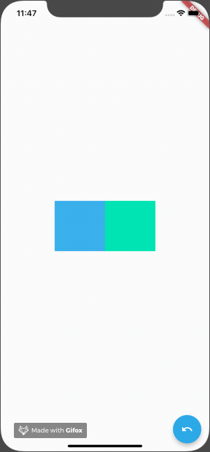
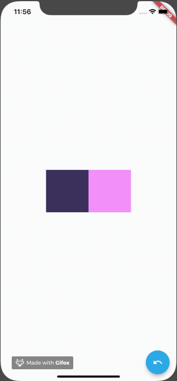
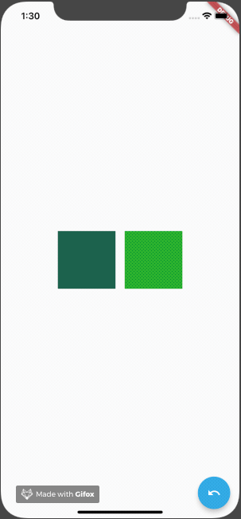
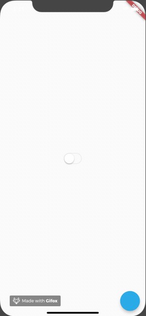

# Flutter | 深入浅出Key

## 前言
在开发 Flutter 的过程中你可能会发现，一些小部件的构造函数中都有一个可选的参数——Key。刚接触的同学或许会对这个概念感到很迷茫，感到不知所措。

在这篇文章中我们会深入浅出的介绍什么是 Key，以及应该使用 key 的具体场景。

## 什么是Key
在 Flutter 中我们经常与状态打交道。我们知道 Widget 可以有 Stateful 和 Stateless 两种。Key 能够帮助开发者在 Widget tree 中保存状态，在一般的情况下，我们并不需要使用 Key。那么，究竟什么时候应该使用 Key呢。

我们来看看下面这个例子。
``` dart
class StatelessContainer extends StatelessWidget {
  final Color color = RandomColor().randomColor();
  
  @override
  Widget build(BuildContext context) {
    return Container(
      width: 100,
      height: 100,
      color: color,
    );
  }
}
```

这是一个很简单的 Stateless Widget，显示在界面上的就是一个 100 * 100 的有颜色的 Container。
RandomColor 能够为这个 Widget 初始化一个随机颜色。

我们现在将这个Widget展示到界面上。

``` dart
class Screen extends StatefulWidget {
  @override
  _ScreenState createState() => _ScreenState();
}

class _ScreenState extends State<Screen> {
  List<Widget> widgets = [
    StatelessContainer(),
    StatelessContainer(),
  ];

  @override
  Widget build(BuildContext context) {
    return Scaffold(
      body: Center(
        child: Row(
          mainAxisAlignment: MainAxisAlignment.center,
          children: widgets,
        ),
      ),
      floatingActionButton: FloatingActionButton(
          onPressed: switchWidget,
        child: Icon(Icons.undo),
      ),
    );
  }

  switchWidget(){
    widgets.insert(0, widgets.removeAt(1));
    setState(() {});
  }
}
```

这里在屏幕中心展示了两个 StatelessContainer 小部件，当我们点击 floatingActionButton 时，将会执行 switchWidget 并交换它们的顺序。


看上去并没有什么问题，交换操作被正确执行了。现在我们做一点小小的改动，将这个 StatelessContainer 升级为 StatefulContainer。

``` dart
class StatefulContainer extends StatefulWidget {
  StatefulContainer({Key key}) : super(key: key);
  @override
  _StatefulContainerState createState() => _StatefulContainerState();
}

class _StatefulContainerState extends State<StatefulContainer> {
  final Color color = RandomColor().randomColor();

  @override
  Widget build(BuildContext context) {
    return Container(
      width: 100,
      height: 100,
      color: color,
    );
  }
}
```
在 StatefulContainer 中，我们将定义 Color 和 build 方法都放进了 State 中。

现在我们还是使用刚才一样的布局，只不过把 StatelessContainer 替换成 StatefulContainer，看看会发生什么。



这时，无论我们怎样点击，都再也没有办法交换这两个Container的顺序了，而 switchWidget 确实是被执行了的。

为了解决这个问题，我们在两个 Widget 构造的时候给它传入一个 UniqueKey。
``` dart
class _ScreenState extends State<Screen> {
  List<Widget> widgets = [
    StatefulContainer(key: UniqueKey(),),
    StatefulContainer(key: UniqueKey(),),
  ];
  ···
```

然后这两个 Widget 又可以正常被交换顺序了。

看到这里大家肯定心中会有疑问，为什么 Stateful Widget 无法正常交换顺序，加上了 Key 之后就可以了，在这之中到底发生了什么？ 为了弄明白这个问题，我们将涉及 Widget 的 diff 更新机制。

### Widget 更新机制

在之前的文章中，我们介绍了 **Widget** 和 **Element** 的关系。若你还对 **Element** 的概念感到很模糊的话，请先阅读 [Flutter | 深入理解BuildContext](https://juejin.im/post/5c665cb651882562914ec153)。

下面来来看Widget的源码。

``` dart
@immutable
abstract class Widget extends DiagnosticableTree {
  const Widget({ this.key });
  final Key key;
  ···
  static bool canUpdate(Widget oldWidget, Widget newWidget) {
    return oldWidget.runtimeType == newWidget.runtimeType
        && oldWidget.key == newWidget.key;
  }
}
```
我们知道 Widget 只是一个配置且无法修改，而 Element 才是真正被使用的对象，并可以修改。

当新的 Widget 到来时将会调用 canUpdate 方法，来确定这个 Element是否需要更新。

canUpdate 对两个（新老） Widget 的 runtimeType 和 key 进行比较，从而判断出当前的 Element 是否需要更新。若 canUpdate 方法返回 true 说明不需要替换 Element，直接更新 Widget 就可以了。

#### StatelessContainer 比较过程

在 StatelessContainer 中，我们并没有传入 key ，所以只比较它们的 **runtimeType**。这里 runtimeType 一致，canUpdate 方法返回 true，两个 Widget 被交换了位置，StatelessElement 调用新持有 Widget 的 build 方法重新构建，在屏幕上两个 Widget 便被正确的交换了顺序。

#### StatefulContainer 比较过程

而在 StatefulContainer 的例子中，我们将 color 的定义放在了 State 中，Widget 并不保存 State，真正 hold State 的引用的是 Stateful Element。

当我们没有给 Widget 任何 key 的时候，将会只比较这两个 Widget 的 runtimeType 。由于两个 Widget 的属性和方法都相同，canUpdate 方法将会返回 true，于是更新 StatefulWidget 的位置，这两个 Element 将不会交换位置。但是原有 Element 只会从它持有的 state 实例中 build 新的 widget。因为 element 没变，它持有的 state 也没变。所以颜色不会交换。这里变换 StatefulWidget 的位置是没有作用的。

而我们给 Widget 一个 key 之后，canUpdate 方法将会比较两个 Widget 的 runtimeType 以及 key。并返回 false。（这里 runtimeType 相同，key 不同）

此时 RenderObjectElement 会用新 Widget 的 key 在老 Element 列表里面查找，找到匹配的则会更新 Element 的位置并更新对应 renderObject 的位置，对于这个例子来讲就是交换了 Element 的位置并交换了对应 renderObject 的位置。都交换了，那么颜色自然也就交换了。

**这里感谢ad6623对之前错误描述的指出。**
### 比较范围
为了提升性能 Flutter 的比较算法（diff）是有范围的，它并不是对第一个 StatefulWidget 进行比较，而是对某一个层级的 Widget 进行比较。

``` dart
···
class _ScreenState extends State<Screen> {
  List<Widget> widgets = [
    Padding(
      padding: const EdgeInsets.all(8.0),
      child: StatefulContainer(key: UniqueKey(),),
    ),
    Padding(
      padding: const EdgeInsets.all(8.0),
      child: StatefulContainer(key: UniqueKey(),),
    ),
  ];
···
```

在这个例子中，我们将两个带 key 的 StatefulContainer 包裹上 Padding 组件，然后点击交换按钮，会发生下面这件奇妙的事情。



两个 Widget 的 Element 并不是交换顺序，而是被重新创建了。

在 Flutter 的比较过程中它下到 Row 这个层级，发现它是一个 MultiChildRenderObjectWidget（多子部件的 Widget）。然后它会对所有 children 层逐个进行扫描。

在Column这一层级，padding 部分的 runtimeType 并没有改变，且不存在 Key。然后再比较下一个层级。由于内部的 StatefulContainer 存在 key，且现在的层级在 padding 内部，该层级没有多子 Widget。runtimeType 返回 flase，Flutter 的将会认为这个 Element 需要被替换。然后重新生成一个新的 Element 对象装载到 Element 树上替换掉之前的 Element。第二个 Widget 同理。

所以为了解决这个问题，我们需要将 key 放到 Row 的 children 这一层级。

``` dart
···
class _ScreenState extends State<Screen> {
  List<Widget> widgets = [
    Padding(
      key: UniqueKey(),
      padding: const EdgeInsets.all(8.0),
      child: StatefulContainer(),
    ),
    Padding(
      key: UniqueKey(),
      padding: const EdgeInsets.all(8.0),
      child: StatefulContainer(),
    ),
  ];
···
```
现在我们又可以愉快的玩耍了（交换 Widget 顺序）了。

#### 扩展内容
slot 能够描述子级在其父级列表中的位置。多子部件 Widget 例如 Row，Column 都为它的子级提供了一系列 slot。

在调用 Element.updateChild 的时候有一个细节，若新老 Widget 的实例相同，注意这里是**实例相同**而不是类型相同， slot 不同的时候，Flutter 所做的仅仅是更新 slot，也就给他换个位置。因 为 Widget 是不可变的，实例相同意味着显示的配置相同，所以要做的仅仅是挪个地方而已。

``` dart
abstract class Element extends DiagnosticableTree implements BuildContext {
···
  dynamic get slot => _slot;
  dynamic _slot;
···
 @protected
  Element updateChild(Element child, Widget newWidget, dynamic newSlot) {
    ···
    if (child != null) {
      if (child.widget == newWidget) {
        if (child.slot != newSlot)
          updateSlotForChild(child, newSlot);
        return child;
      }
      if (Widget.canUpdate(child.widget, newWidget)) {
        if (child.slot != newSlot)
          updateSlotForChild(child, newSlot);
        child.update(newWidget);
        assert(child.widget == newWidget);
        assert(() {
          child.owner._debugElementWasRebuilt(child);
          return true;
        }());
        return child;
      }
      deactivateChild(child);
      assert(child._parent == null);
    }
    return inflateWidget(newWidget, newSlot);
  }
```
  更新机制表
|                 | 新WIDGET为空              | 新 Widget不为空                                              |
| :-------------: | :------------------------ | :----------------------------------------------------------- |
|  **child为空**  | 返回null。                | 返回新的 Element                                             |
| **child不为空** | 移除旧的widget，返回null. | 若旧的child Element 可以更新（canUpdate）则更新并将其返回，否则返回一个新的 Element. |

## Key 的种类
### Key
``` dart
@immutable
abstract class Key {
  const factory Key(String value) = ValueKey<String>;

  @protected
  const Key.empty();
}
```
默认创建 Key 将会通过工厂方法根据传入的 value 创建一个 ValueKey。

Key 派生出两种不同用途的 Key：LocalKey 和 GlobalKey。
### Localkey
LocalKey 直接继承至 Key，它应用于拥有相同父 Element 的小部件进行比较的情况，也就是上述例子中，有一个多子 Widget 中需要对它的子 widget 进行移动处理，这时候你应该使用Localkey。

Localkey 派生出了许多子类 key：

- ValueKey : ValueKey('String')
- ObjectKey : ObjectKey(Object)
- UniqueKey : UniqueKey()

Valuekey 又派生出了 PageStorageKey : PageStorageKey('value')
### GlobalKey
``` dart
@optionalTypeArgs
abstract class GlobalKey<T extends State<StatefulWidget>> extends Key {
···
static final Map<GlobalKey, Element> _registry = <GlobalKey, Element>{};
static final Set<Element> _debugIllFatedElements = HashSet<Element>();
static final Map<GlobalKey, Element> _debugReservations = <GlobalKey, Element>{};
···
BuildContext get currentContext ···
Widget get currentWidget ···
T get currentState ···
```
GlobalKey 使用了一个静态常量 Map 来保存它对应的 Element。

你可以通过 GlobalKey 找到持有该GlobalKey的 **Widget**，**State** 和 **Element**。

注意：GlobalKey 是非常昂贵的，需要谨慎使用。

## 什么时候需要使用 Key
### ValueKey
如果您有一个 Todo List 应用程序，它将会记录你需要完成的事情。我们假设每个 Todo 事情都各不相同，而你想要对每个 Todo 进行滑动删除操作。

这时候就需要使用 ValueKey！

```dart
return TodoItem(
    key: ValueKey(todo.task),
    todo: todo,
    onDismissed: (direction){
        _removeTodo(context, todo);
    },
);
```
### ObjectKey
如果你有一个生日应用，它可以记录某个人的生日，并用列表显示出来，同样的还是需要有一个滑动删除操作。

我们知道人名可能会重复，这时候你无法保证给 Key 的值每次都会不同。但是，当人名和生日组合起来的 Object 将具有唯一性。

这时候你需要使用 ObjectKey！

### UniqueKey
如果组合的 Object 都无法满足唯一性的时候，你想要确保每一个 Key 都具有唯一性。那么，你可以使用 UniqueKey。它将会通过该对象生成一个具有唯一性的 hash 码。

不过这样做，每次 Widget 被构建时都会去重新生成一个新的 UniqueKey，失去了一致性。也就是说你的小部件还是会改变。（还不如不用😂）

### PageStorageKey
当你有一个滑动列表，你通过某一个 Item 跳转到了一个新的页面，当你返回之前的列表页面时，你发现滑动的距离回到了顶部。这时候，给 Sliver 一个 PageStorageKey！它将能够保持 Sliver 的滚动状态。

### GlobalKey
GlobalKey 能够跨 Widget 访问状态。
在这里我们有一个 Switcher 小部件，它可以通过 changeState 改变它的状态。
``` dart
class SwitcherScreenState extends State<SwitcherScreen> {
  bool isActive = false;

  @override
  Widget build(BuildContext context) {
    return Scaffold(
      body: Center(
        child: Switch.adaptive(
            value: isActive,
            onChanged: (bool currentStatus) {
              isActive = currentStatus;
              setState(() {});
            }),
      ),
    );
  }

  changeState() {
    isActive = !isActive;
    setState(() {});
  }
}
```
但是我们想要在外部改变该状态，这时候就需要使用 GlobalKey。
``` dart
class _ScreenState extends State<Screen> {
  final GlobalKey<SwitcherScreenState> key = GlobalKey<SwitcherScreenState>();

  @override
  Widget build(BuildContext context) {
    return Scaffold(
      body: SwitcherScreen(
        key: key,
      ),
      floatingActionButton: FloatingActionButton(onPressed: () {
        key.currentState.changeState();
      }),
    );
  }
}
```
这里我们通过定义了一个 GlobalKey<SwitcherScreenState> 并传递给 SwitcherScreen。然后我们便可以通过这个 key 拿到它所绑定的 SwitcherState 并在外部调用 changeState 改变状态了。



## 参考资料
- [何时使用密钥 - Flutter小部件 101 第四集](https://www.youtube.com/watch?v=kn0EOS-ZiIc&feature=youtu.be)
- [widgets-intro#keys](https://flutter.dev/docs/development/ui/widgets-intro#keys)

# 写在最后
这篇文章的灵感来自于 **何时使用密钥 - Flutter小部件 101 第四集**， 强烈建议大家观看这个系列视频，你会对 Flutter 如何构建视图更加清晰。也希望这篇文章对你有所帮助！

文章若有不对之处还请各位高手指出，欢迎在下方评论区以及我的邮箱1652219550a@gmail.com留言，我会在24小时内与您联系！